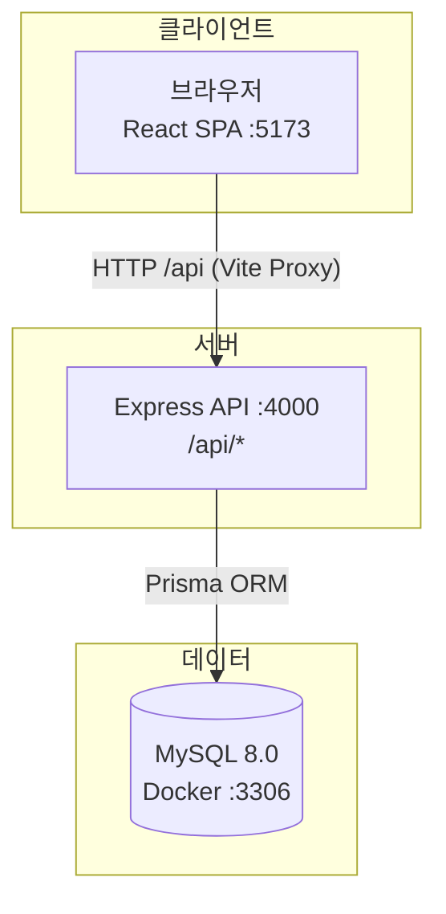
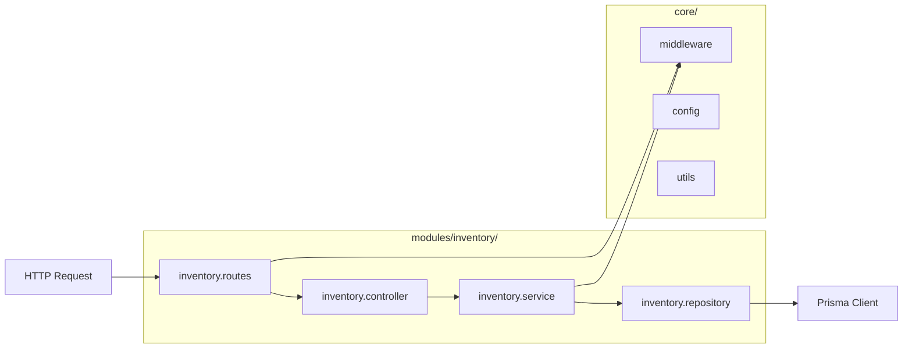
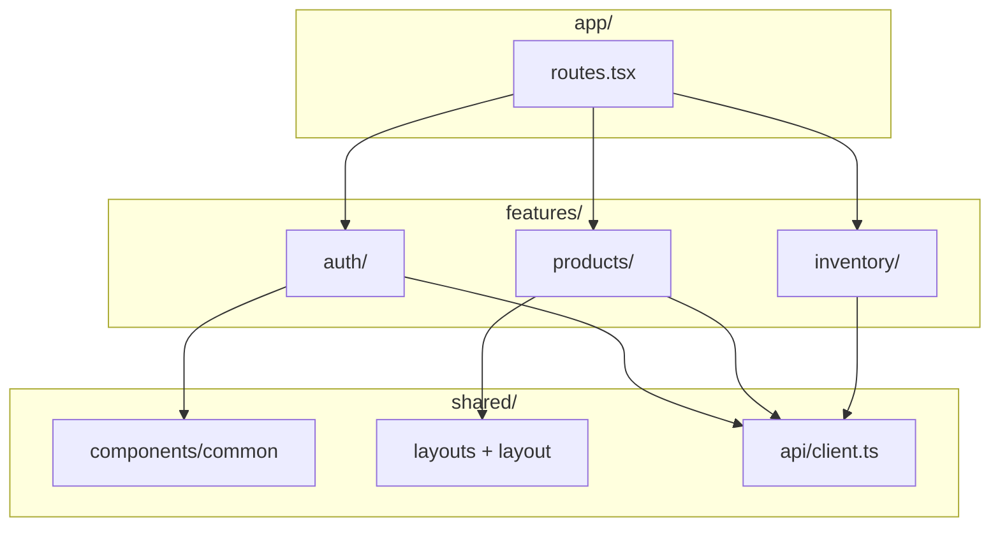
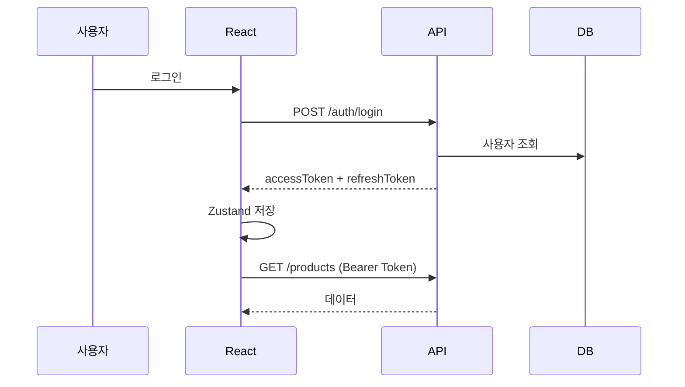
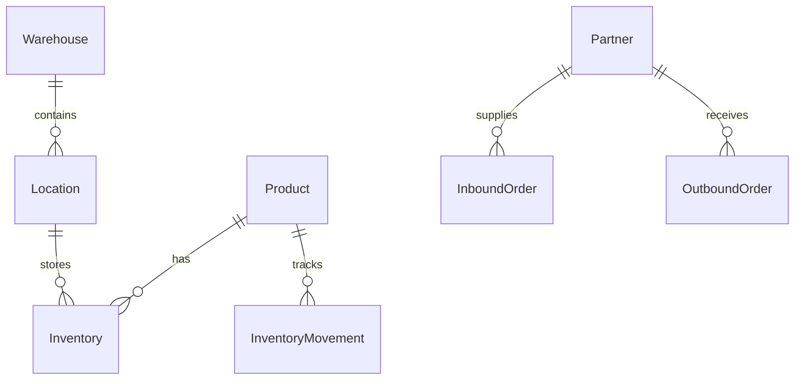

# SmartFlow WMS — 아키텍처

## 시스템 개요

SmartFlow WMS는 **React SPA(메인 UI)** + **Express REST API** + **MySQL** 3-tier 구조입니다.

## 레이어 구조 (Backend)

도메인별 **Module 패턴** — 각 기능이 routes → controller → service → repository 로 분리됩니다.

| 레이어 | 역할 | 예시 |
|--------|------|------|
| **routes** | URL 매핑, 미들웨어 적용 | `GET /inventory` |
| **controller** | req/res 처리, HTTP 상태코드 | `inventoryController.list` |
| **service** | 비즈니스 로직, 검증(Zod) | 재고 이동 트랜잭션 |
| **repository** | DB 접근 (Prisma) | `inventoryRepository.findMany` |
| **core** | 공통 인프라 | 인증, 에러, 페이지네이션 |

## 레이어 구조 (Frontend)

**Feature-based** — 기능 단위로 API·컴포넌트·페이지를 묶습니다.

| 레이어 | 역할 |
|--------|------|
| **app/** | 라우팅, App 진입 |
| **features/** | 도메인별 pages, components, api, stores |
| **shared/** | 재사용 UI, API 클라이언트, 전역 스타일 |

## 인증 흐름

## 데이터 모델 (핵심)

## API 규칙

- Base URL: `/api`
- 응답 형식: `{ success, message?, data? }`
- 인증: `Authorization: Bearer <accessToken>`
- 역할: `ADMIN`, `STAFF` (`authorize` 미들웨어)

## 배포 관점

| 구분 | 개발 | 운영 (권장) |
|------|------|-------------|
| Frontend | Vite dev server | Nginx / CDN (static) |
| Backend | tsx watch | Node.js + PM2 |
| DB | Docker Compose | Managed MySQL |
